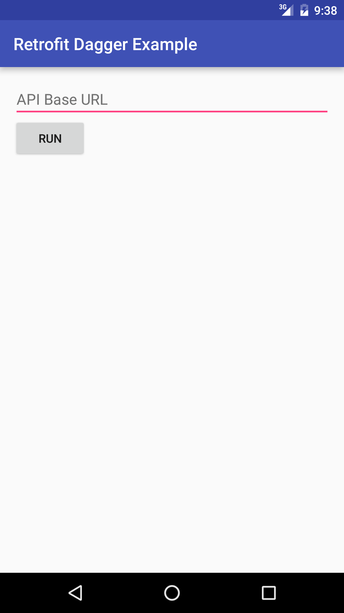
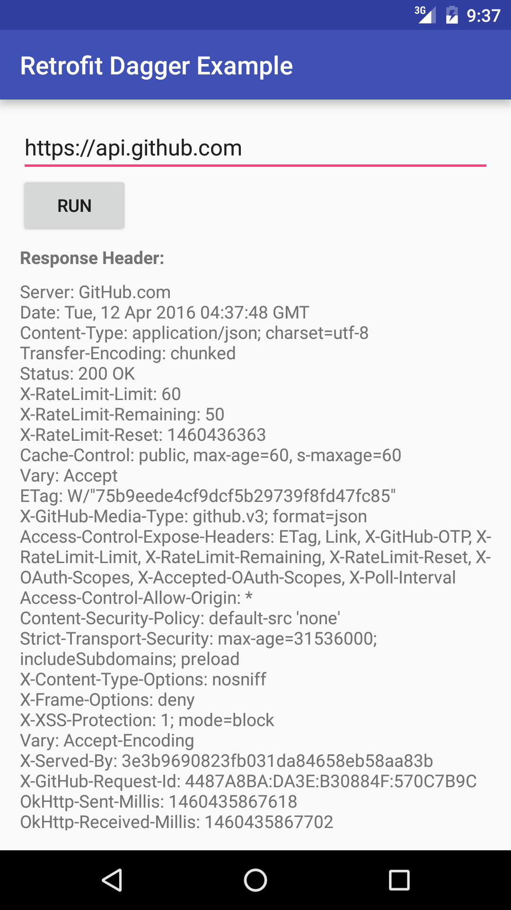

# Android example using Dagger2 and Retrofit2 with Dynamic Base URL
Android example showing how to change the Base URL in Retrofit2 dynamically during runtime even though Retrofit2 has already been injected in your application using Dagger2. I got the base concept from [here](https://gist.github.com/swankjesse/8571a8207a5815cca1fb).

The whole purpose of this is so we don't have to create multiple instances of Retrofit2 when, for whatever reason, the Base URL changes or when we don't know the Base URL because the User has to put it in.

 

Notes:
* See git commit log for procedural steps of how to construct this example.
